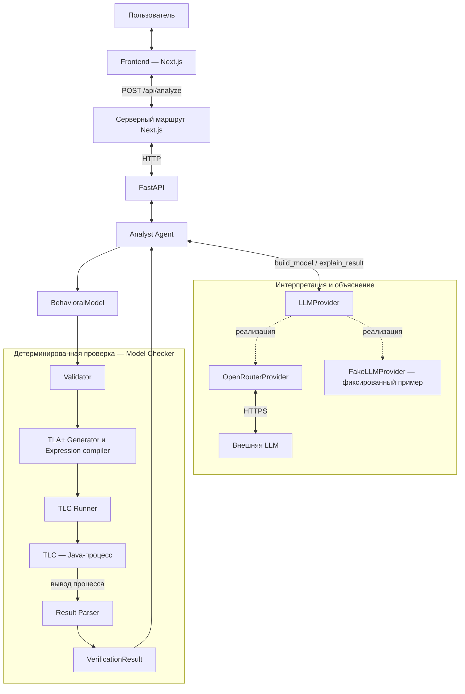

# Архитектура системы

Система состоит из Frontend на Next.js, backend на FastAPI, Analyst Agent и детерминированного Model Checker. Frontend подключён к API через серверный маршрут Next.js. Backend обрабатывает запрос последовательно; TLC запускается отдельным Java-процессом.

## Разделение ответственности

**Вероятностная часть — LLM / Analyst Agent.** LLM интерпретирует требования, формирует модель и свойства, затем объясняет результат. Analyst Agent управляет последовательностью вызовов провайдера и Model Checker.

**Детерминированная часть — Model Checker / TLC.** Model Checker валидирует формальную модель, компилирует её в TLA+, запускает TLC и разбирает результат. Перебор состояний выполняет TLC без участия LLM.

`BehavioralModel` — граница между этими частями. Она позволяет независимо проверить последствия выбранной интерпретации и сопоставить контрпример с исходным текстом. Validator проверяет формальную корректность модели, а TLC — её свойства; соответствие модели смыслу требований требует отдельной оценки.

## Схема компонентов



`FakeLLMProvider` реализует тот же интерфейс, что и OpenRouter, но работает детерминированно: возвращает заранее заданную модель и шаблонное объяснение. Model Checker в обоих режимах использует настоящий TLC.

## Компоненты

| Компонент | Ответственность |
| --- | --- |
| Frontend | Ввод требований, HTTP-клиент, отображение модели, свойств, результата и шагов контрпримера |
| Серверный маршрут Next.js | Передача JSON в FastAPI, адрес из `BACKEND_URL`, сохранение HTTP-статуса и обработка недоступности backend |
| FastAPI | `GET /health`, `POST /api/analyze`, проверка входного текста, выбор провайдера, возврат `AnalysisResult` |
| Analyst Agent | Последовательные вызовы `build_model`, `verify`, `explain_result` и сборка ответа |
| `LLMProvider` | Интерфейс `build_model(requirements) → BehavioralModel` и `explain_result(requirements, model, result) → str` |
| `OpenRouterProvider` | Два HTTPS-запроса через HTTPX: получение JSON модели и генерация объяснения; проверка ответа и валидация модели |
| `FakeLLMProvider` | Демонстрационный сценарий заявки и отмены; фраза `approved = false` выбирает исправленный вариант |
| `BehavioralModel` | Строгие Pydantic-схемы переменных, начального состояния, переходов и свойств |
| Validator | Проверка типов, конечных доменов, ссылок, уникальности имён, выражений и присваиваний |
| Expression / TLA+ compiler | Компиляция литералов и операторов `var`, `eq`, `in`, `and`, `or`, `not` |
| TLA+ Generator | Создание `.tla` и `.cfg`: `Init`, `Next`, `Spec`, `TypeOK`, переходы и инварианты |
| TLC Runner | Запись временных файлов, запуск Java subprocess, контроль timeout и передача вывода парсеру |
| TLC | Перебор достижимых состояний и проверка инвариантов |
| Result Parser | Определение статуса, извлечение статистики, состояний и названий переходов |
| `VerificationResult` | Структурированный результат проверки, отделённый от объяснения LLM |

Backend работает без базы данных и очереди задач. Каждый запрос выполняется за один проход; история анализов не сохраняется. Публичный вход Model Checker — функция `verify`.

Браузер обращается к своему origin `/api/analyze`; Next.js пересылает запрос на `BACKEND_URL` (по умолчанию `http://127.0.0.1:8000`). Ключ LLM остаётся на backend, CORS для браузера не требуется. Mock-ответов во frontend нет. Прокси ждёт не более 300 секунд и возвращает HTTP 504 при timeout, HTTP 502 при недоступности или некорректном ответе backend. Клиент показывает ошибки без старого результата; эти HTTP-ошибки не являются результатами TLC.

## Модель и компиляция

`BehavioralModel` содержит `variables`, `initial`, `transitions`, `properties`. Поддерживаются `enum`, `boolean` и `integer` с конечными границами. Имена — ASCII-идентификаторы, значения `enum` — непустые печатные ASCII-строки. Арифметические операции в DSL не поддерживаются.

`Transition` содержит `name`, булев `guard` и непустой список `effects`. Эффект `set` присваивает литерал или значение другой переменной. Все правые части вычисляются по состоянию до перехода. Переменные без присваивания сохраняются через `UNCHANGED`. Префиксы `v_`, `Step_`, `Property_` разделяют имена переменных, переходов и свойств в TLA+.

`Property` содержит `name`, `type`, `expression`. Поддерживаются `invariant` и `forbidden_state`; запрещённое состояние компилируется в отрицание его выражения. Конфигурация TLC включает `TypeOK` и все свойства как инварианты.

В `Next` добавляется `UNCHANGED vars`, поэтому терминальное состояние не вызывает ошибку deadlock. Для поддержки `deadlock_free` потребуется отдельно определить семантику допустимых конечных состояний и блокировок.

`OpenRouterProvider`, `verify` и `generate_tla` используют общий `validate_model`. Провайдер проверяет JSON от LLM; перед проверкой и генерацией модель валидируется повторно.

## Запуск TLC и разбор результата

Runner создаёт временные `Model.tla` и `Model.cfg` и запускает:

```text
java -cp <tla2tools.jar> tlc2.TLC -workers 1 -config Model.cfg Model.tla
```

Разбор TLA+ выполняется при запуске TLC; отдельного вызова SANY нет. После завершения временный каталог удаляется. API возвращает результат проверки; тексты TLA+ доступны через `generate_tla`.

Result Parser обрабатывает текстовый вывод TLC. Для `PROPERTY_HOLDS` нужны явное сообщение о завершении без ошибок и код выхода 0. Timeout имеет приоритет над маркером успеха. `STATE_LIMIT_REACHED` распознаётся по тексту вывода движка, но `TLCConfig` пока не позволяет задать максимальное число состояний.

Названия переходов извлекаются из меток `Step_*` или определяются по guard/effects между соседними состояниями трассы. Если соответствие неоднозначно, `transition` остаётся `null`. Парсер анализирует готовую трассу и не выполняет самостоятельный перебор состояний.

## Контракт результата

`VerificationResult` содержит:

- `status`, `message`, `violated_property`;
- `counterexample`: список `TraceState(number, values, transition, tlc_label)` с нумерацией TLC от 1;
- `statistics`: `generated_states`, `distinct_states`, `queued_states`, `graph_depth`;
- `stdout`, `stderr`, `exit_code`.

`PROPERTY_HOLDS` относится ко всем заданным инвариантам завершённого запуска. При нарушении возвращается найденное TLC свойство и его контрпример; полного перечня всех нарушений один запуск не формирует.

`AnalysisResult` содержит `requirements`, `behavioral_model`, `verification_result`, `counterexample`, `explanation`. Верхнее поле `counterexample` дублирует трассу из результата проверки. При её отсутствии верхнее поле равно `null`, а вложенный список — `[]`.

Текущий контракт использует `name` для свойства, `violated_property` для нарушенного свойства и `values` для значений состояния. Поля `id`, `property_id`, `engine` и `related_requirements` не поддерживаются.

## HTTP и ошибки

| Ситуация | Ответ |
| --- | --- |
| Пустой или отсутствующий текст; неподдерживаемая тема для fake | HTTP 422 |
| Неизвестный провайдер; отсутствует ключ или модель OpenRouter | HTTP 503 |
| Ошибка OpenRouter, неверный JSON или невалидная модель LLM | HTTP 502 |
| Анализ завершён и объяснение получено | HTTP 200 с `AnalysisResult`; статус проверки находится в `verification_result.status` |

`/health` проверяет доступность HTTP-приложения. Готовность OpenRouter и TLC проверяется при анализе требования.

Если второй вызов LLM для объяснения завершается ошибкой, API возвращает 502 без частичного результата TLC. Автоматическое исправление модели, повторные запросы и переключение на fake пока не поддерживаются.

## Настройки

`LLM_PROVIDER` выбирает `fake` по умолчанию или `openrouter`. Ключ и модель задаются через `OPENROUTER_API_KEY` и `OPENROUTER_MODEL`. Настройки Analyst Agent читаются из окружения или конфигурационного файла backend с приоритетом окружения.

Runner получает `MODEL_CHECKER_JAVA`, `MODEL_CHECKER_TLA2TOOLS_JAR`, `MODEL_CHECKER_TIMEOUT_SECONDS`, `MODEL_CHECKER_TEMP_DIR` только из окружения. Timeout TLC по умолчанию — 60 секунд, HTTPX у OpenRouter — 90 секунд. Общий лимит времени на весь анализ не задан.

Во внешний LLM API передаются требования, а при объяснении — также модель и результат без `stdout/stderr`. Достоверность модели и объяснения по смыслу автоматически не оценивается.

Поддержка `reachable`, `deadlock_free`, ссылок на исходные требования и диалога уточнений планируется отдельно. Результаты текущих проверок приведены в [описании прототипа](prototype.md).
